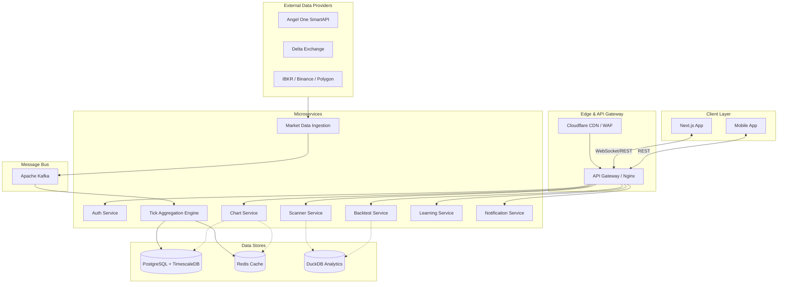

# Platform Architecture Specification

This document outlines the architecture for the institutional-grade market intelligence, orderflow analysis, scanning, strategy creation, and backtesting platform.

## High-Level System Architecture

## Data Flow: Market Data Ingestion
**Raw ticks → Kafka → Tick Aggregator → TimescaleDB + Redis → WebSocket fanout → Client**
1. **Ingestion Layer:** Connects to brokers (e.g., Angel One, Delta Exchange) via WebSockets and REST. Normalizes raw ticks into standard protobuf/JSON formats.
2. **Message Bus (Kafka):** Tick data is pushed to Kafka topics (e.g., `ticks.equity`, `ticks.crypto`).
3. **Tick Aggregator:** Consumers read from Kafka, build timeframes (1m, 5m, 1h), and update volume/market profiles in real-time.
4. **Storage:**
   - **TimescaleDB:** Persists ticks and historical candles.
   - **Redis:** Stores the latest quotes, L2/L3 order book snapshots, and session states.
5. **Distribution:** A WebSocket fanout service reads aggregated state from Redis/Kafka and streams updates to subscribed clients.

## Microservices Decomposition
Bounded contexts ensure loose coupling and domain segregation:
- **Auth Service:** JWT-based authentication, RBAC, OAuth2 integration.
- **Market Data Ingestion:** Standardizes multi-broker connections.
- **Tick Aggregation Engine:** Core low-latency engine building candles, TPOs, and footprint data.
- **Chart Service:** Serves historical and real-time data for charting libraries.
- **Scanner Service:** Evaluates conditions against real-time streams and DuckDB analytical views.
- **Backtest Service:** Vectorized execution engine using Pandas/Polars for strategy validation.
- **Learning Service:** Serves educational content, quizzes, and tracking (Platform teaches, never signals).
- **Notification Service:** Delivers alerts via email, SMS, and in-app toasts.

## API Gateway Design
- **Routing:** Routes traffic to internal microservices.
- **Rate Limiting:** IP/User based limits backed by Redis.
- **Authentication:** Validates JWTs before passing requests downstream.

## WebSocket Architecture
- **Connection Management:** Handles thousands of concurrent connections.
- **Channel Subscriptions:** Clients subscribe to specific instruments or aggregated metrics (e.g., `NIFTY50_1m`, `BTCUSD_orderbook`).
- **Heartbeats:** Ping/pong every 30s to keep connections alive and prune dead ones.
- **Reconnection:** Client-side exponential backoff, server-side session recovery.

## Message Bus Strategy (Kafka)
- **Topics:** Designed by asset class and domain:
  - `market.ticks.in`
  - `market.candles.out`
  - `scanner.events`
  - `backtest.jobs`
- **Partitions:** Keyed by instrument symbol (e.g., `RELIANCE`) to guarantee ordering.

## Caching Strategy
- **Redis:** Hot data (current quotes, order books, active alerts, session tokens).
- **DuckDB:** Embedded OLAP analytics for fast scanner queries and backtest aggregations.

## Frontend Architecture
- **Framework:** Next.js App Router (React).
- **State Management:** Zustand for global state, React Query for server state.
- **Charting Pipeline:** TradingView Lightweight Charts + custom Canvas/WebGL overlays for Market/Volume profiles.
- **Component Hierarchy:** Layouts → Workspaces → Panels (Charts, DOM, Scanners).

## Deployment Topology
- **Dev:** Docker Compose for local environments.
- **Prod:** Kubernetes (EKS/GKE) with auto-scaling node groups.
- **Edge:** Cloudflare for CDN, DDoS protection, and WAF.

## Monitoring Stack
- **Metrics:** Prometheus + Grafana dashboards.
- **Tracing:** OpenTelemetry (distributed request traces).
- **Errors:** Sentry for frontend and backend exception tracking.

## Failure Modes and Recovery Strategies
- **Data Provider Outage:** Failover to secondary data source (e.g., Angel One → Upstox).
- **Kafka Node Failure:** Multi-broker setup with replication factor 3.
- **WebSocket Disconnect:** Auto-reconnection with catch-up REST API calls to fill gaps.
- **Database Overload:** Read replicas and caching via Redis.

## Capacity Planning Estimates
- **Ticks:** ~50,000 messages/sec during peak market hours.
- **Storage:** ~2 TB per month (TimescaleDB compressed).
- **Compute:** 20-30 Kubernetes nodes (m5.large or similar) scaling up/down.
- **Concurrent Users:** Designed for 100k active websocket connections.
