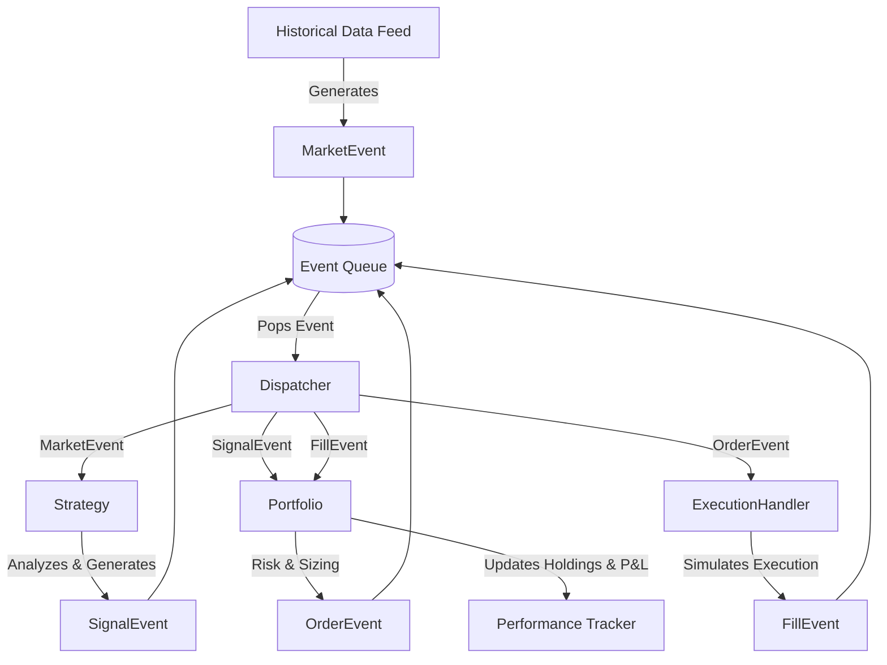

# Backtest Engine Specification

## 1. Architecture Overview
The backtesting engine uses an **Event-Driven Architecture** (rather than a vectorized approach) to ensure high-fidelity simulation of market conditions, avoiding lookahead bias and allowing accurate modeling of order execution, slippage, and partial fills.

### 1.1 Event Loop Data Flow


## 2. Event Types
The system relies on four primary event types:

```python
class Event:
    pass

class MarketEvent(Event):
    def __init__(self, timestamp, symbol, open, high, low, close, volume, tick_data=None):
        self.type = 'MARKET'
        self.timestamp = timestamp
        self.symbol = symbol
        self.data = {'O': open, 'H': high, 'L': low, 'C': close, 'V': volume}

class SignalEvent(Event):
    def __init__(self, strategy_id, symbol, timestamp, signal_type, strength):
        self.type = 'SIGNAL'
        self.symbol = symbol
        self.signal_type = signal_type # 'LONG', 'SHORT', 'EXIT'
        self.strength = strength       # [0.0, 1.0]

class OrderEvent(Event):
    def __init__(self, symbol, order_type, quantity, direction, limit_price=None, stop_price=None):
        self.type = 'ORDER'
        self.symbol = symbol
        self.order_type = order_type   # 'MKT', 'LMT', 'STP'
        self.quantity = quantity
        self.direction = direction     # 'BUY', 'SELL'

class FillEvent(Event):
    def __init__(self, timestamp, symbol, exchange, quantity, direction, fill_price, commission):
        self.type = 'FILL'
        self.timestamp = timestamp
        self.symbol = symbol
        self.quantity = quantity
        self.direction = direction
        self.fill_price = fill_price
        self.commission = commission
```

## 3. Interfaces

### 3.1 Strategy Interface
```python
from abc import ABC, abstractmethod

class BaseStrategy(ABC):
    @abstractmethod
    def on_data(self, event: MarketEvent):
        """Called when new market data arrives."""
        pass

    @abstractmethod
    def generate_signals(self):
        """Evaluates internal state to emit SignalEvents."""
        pass
        
    @abstractmethod
    def on_fill(self, event: FillEvent):
        """Callback for when an order is executed."""
        pass
```

## 4. Execution Simulation

### 4.1 Slippage and Commission Models
- **Slippage**: 
  - *Fixed*: N basis points applied to the execution price.
  - *Volume-proportional*: Slippage increases as order size approaches a configurable percentage of the bar's volume.
  - *Tick-based*: Simulated using historical bid/ask tick data if available.
- **Commission**: Flat fee per trade, percentage of notional, or per-share (e.g., $0.005/share).
- **Fill Price Model**: 
  - *Next Bar Open*: Standard conservative approach.
  - *VWAP*: For large institutional orders filling over a timeframe.
  - *Worst-Case*: High of bar for BUY, Low of bar for SELL.
- **Partial Fills**: Simulated when order quantity exceeds 10% of candle volume. Remaining quantity becomes a resting limit order.

## 5. Advanced Backtest Types
- **Single Stock**: Baseline backtest on one instrument.
- **Portfolio**: Multiple stocks sharing a centralized capital pool, with rebalancing events.
- **Sector**: Dynamically loading all constituents of a sector ETF.
- **Market Regime**: Segmenting trades by VIX level or SMA trend vs. range state.
- **Event**: Anchoring entry/exits around exogenous events (earnings dates, dividend distributions).
- **Options**: Simulating Greek exposures (Delta, Gamma, Theta, Vega) over time for spreads/straddles.

## 6. Optimization & Robustness

### 6.1 Walk-Forward Optimization (WFO)
Iterative in-sample (IS) training and out-of-sample (OOS) validation.
- Anchored: IS window grows, OOS window moves forward.
- Rolling: Fixed IS window moving forward alongside OOS window.

### 6.2 Monte Carlo Simulation
- **Trade Resampling**: Randomizing the sequence of trades 10,000 times to construct an equity curve distribution.
- Metrics output: 5th, 25th, 50th, 75th, 95th percentile curves, probability of ruin, Max DD distribution.

### 6.3 Robustness Testing
- Parameter sensitivity: ±20% perturbation of strategy inputs.
- Data perturbation: Injecting random noise (0.01%) into historical prices to test for overfitting.

## 7. Performance Metrics
- **Returns**: Total Return, CAGR, Monthly/Yearly Return Heatmap.
- **Risk-Adjusted**: Sharpe Ratio, Sortino Ratio, Calmar Ratio.
- **Drawdown**: Max Drawdown (%), Average Drawdown, Drawdown Duration (days).
- **Trade Stats**: Win Rate, Profit Factor, Expectancy, Kelly Criterion optimal fraction.

## 8. Guardrails
- **Lookahead Bias Guard**: Strict chronological queue processing. State queries validate against `event.timestamp`.
- **Survivorship Bias Handling**: Universe data must include delisted assets via historical API mapping.
