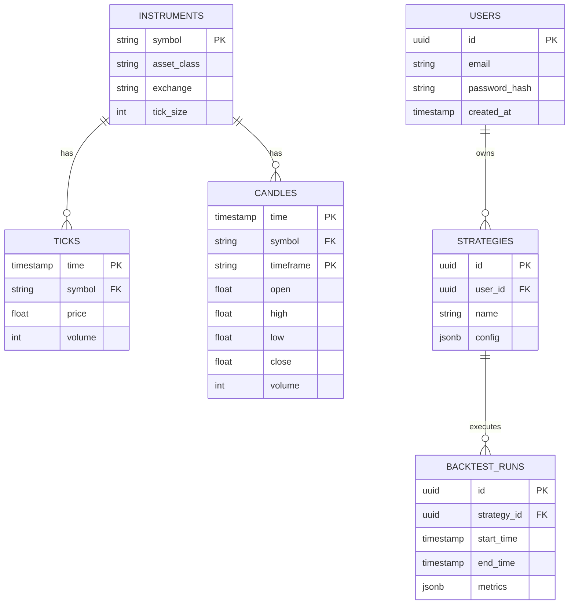

# Database Schema Specification

This document details the database schemas and data stores used in the platform.

## Relational & Time-Series Design (PostgreSQL + TimescaleDB)



### TimescaleDB Hypertables (High-Volume Data)
1. **`ticks`**
   - `time` (TIMESTAMPTZ, Index)
   - `symbol` (VARCHAR, Index)
   - `price` (DOUBLE PRECISION)
   - `volume` (BIGINT)
   - `bid`, `ask` (DOUBLE PRECISION)
   - `bid_size`, `ask_size` (BIGINT)
2. **`candles`** (OHLCV per timeframe)
   - `time` (TIMESTAMPTZ)
   - `symbol` (VARCHAR)
   - `timeframe` (VARCHAR) (e.g., '1m', '5m', '1D')
   - `open`, `high`, `low`, `close` (DOUBLE PRECISION)
   - `volume` (BIGINT)
3. **`market_profile_tpo`** & **`volume_profile_bins`**
   - Stores aggregated volume at price levels for institutional analysis.

### PostgreSQL Relational Tables
- **`users`**: Core user accounts, auth data, and subscription tier.
- **`instruments`**, **`sectors`**, **`industries`**: Reference metadata.
- **`strategies`**, **`scan_templates`**: User-defined configurations.
- **`backtest_runs`**, **`backtest_trades`**: Historical execution data.
- **`watchlists`**, **`alerts`**: User operational states.
- **`corporate_actions`**, **`earnings`**: Event data.

## Redis Data Structures (In-Memory Hot Data)
- **Current Quotes:** Hash maps `quote:{symbol}` -> `{price, volume, change}`.
- **Order Book Snapshots:** Sorted sets `orderbook:{symbol}:bids` and `orderbook:{symbol}:asks` scored by price.
- **Session State:** User auth tokens, CSRF tokens.
- **Rate Limits:** Counters `ratelimit:{ip}:{endpoint}`.
- **WebSocket Subscriptions:** Sets tracking active channel listeners.

## DuckDB Analytical Schemas
Used for embedded fast analytics, scanners, and complex backtest metrics:
- **`historical_scans`**: Parquet-backed snapshots of market breadth.
- **`backtest_analytics`**: Zero-copy analysis on huge trade logs.
- **`sector_rotation_matrices`**: OLAP cubes computing relative strength.

## Indexing & Partitioning Strategy
- **TimescaleDB:** Partitioned automatically by `time`. Custom spatial partitioning by `symbol` hash if volume dictates.
- **Indexes:** B-Tree on `(symbol, time)` for candles. GIN indexes on JSONB columns (e.g., `strategies.config`).

## Data Retention Policies
- **Hot Tier (Redis/Memory):** Intraday ticks, active orderbooks.
- **Warm Tier (TimescaleDB uncompressed):** Last 30 days of 1m candles.
- **Cold Tier (TimescaleDB compressed / S3 Parquet):** Older than 30 days.

## Migration Strategy (From YFinance)
1. **Parallel Run:** Keep YFinance feed running while ingesting new institutional feeds.
2. **Backfill:** Fetch historical data from new providers and load into TimescaleDB.
3. **Cutover:** Switch gateway routes to point to the new institutional data adapters.

## Sample Queries

**Fetch latest 1h candles for NIFTY50:**
```sql
SELECT time, open, high, low, close, volume 
FROM candles 
WHERE symbol = 'NIFTY50' AND timeframe = '1h'
ORDER BY time DESC LIMIT 100;
```
